# sat-pass

내 위치에서 인공위성의 스케줄을 확인 할 수 있는 안드로이드 앱.

관심 있는 위성을 등록해 두면 앞으로 며칠간의 패스 일정을 시간순으로 보여 주고,
패스가 시작되기 전에 알림을 받을 수 있습니다.

<p align="center">
  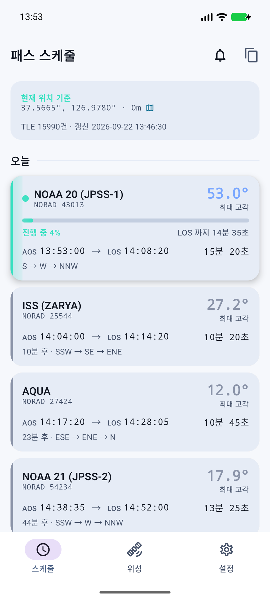
  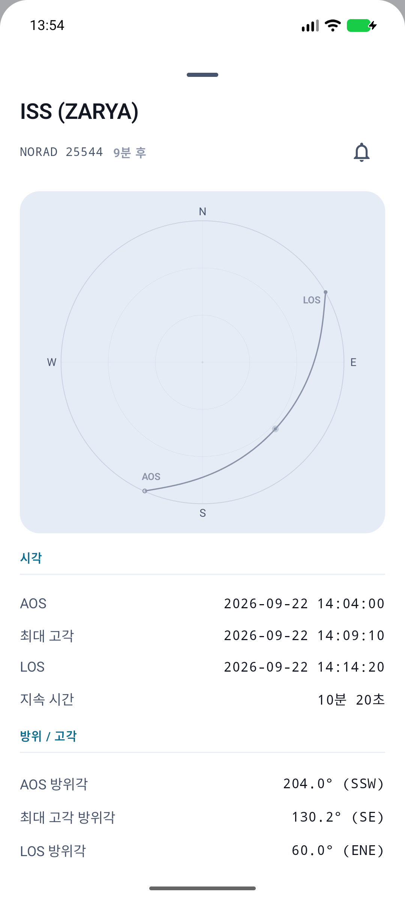
  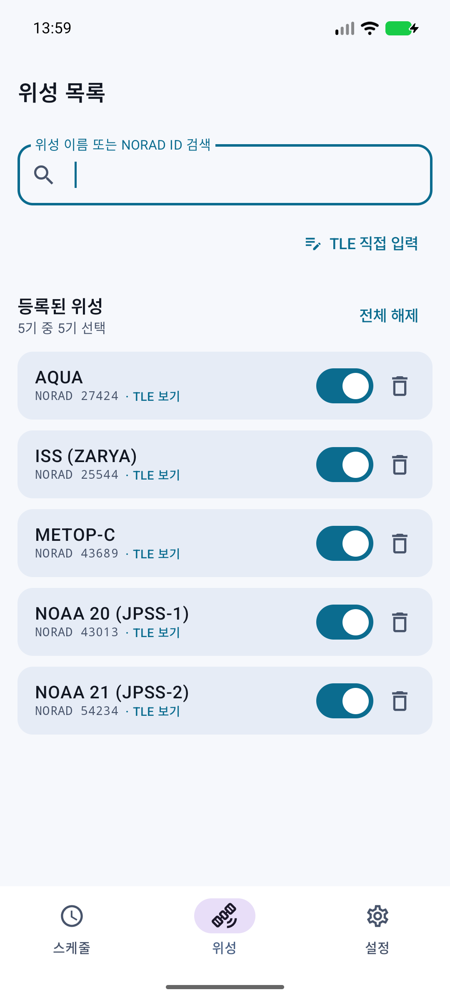
</p>

---

## 설치

1. 이 저장소의 [Releases](../../releases) 에서 최신 `sat-pass-*.apk` 를 **휴대폰 브라우저로** 받습니다.
2. 처음 설치할 때는 브라우저에 "출처를 알 수 없는 앱 설치" 권한을 허용해야 합니다.
3. 받은 파일을 열면 설치됩니다.

**필요 환경**: 안드로이드 8.0(Oreo) 이상

---

## 처음 시작하기

앱을 처음 켜면 아무것도 표시되지 않습니다. 아래 순서로 3분이면 준비가 끝납니다.

### 1단계 — TLE 받기

위성 위치를 계산하려면 **TLE**(궤도 정보)가 필요합니다.

**스케줄** 탭에서 화면을 **아래로 당겼다 놓으면** 인터넷에서 활성 위성 전체(1만 5천 개 이상)의
TLE 를 받아옵니다. 몇 초 걸립니다.

### 2단계 — 관심 위성 추가

**위성** 탭에서 위성 이름이나 NORAD 번호로 검색합니다. (예: `NOAA 20`, `25544`)

검색 결과 오른쪽의 **+** 를 누르면 목록에 추가됩니다.

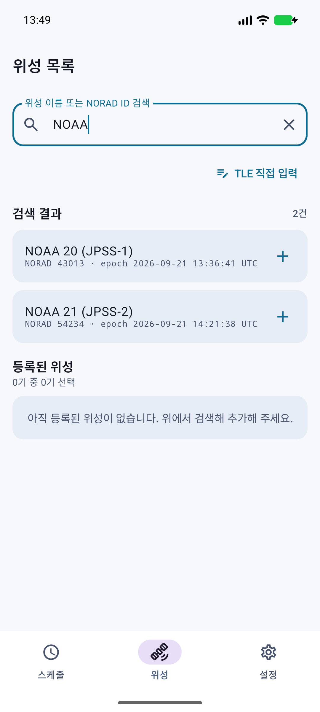

### 3단계 — 위치 허용

**스케줄** 탭 위쪽의 **위치 허용** 을 눌러 권한을 주면 현재 위치 기준으로 계산합니다.

권한을 주지 않으면 기본 좌표로 계산되며, 원하는 좌표를 직접 등록할 수도 있습니다.
(→ [관측 위치 바꾸기](#관측-위치-바꾸기))

---

## 스케줄 화면

등록한 위성들의 패스가 **빠른 순서대로** 날짜별로 묶여 표시됩니다.

### 카드 읽는 법

| 표시 | 뜻 |
| --- | --- |
| **AOS** | 위성이 지평선 위로 올라오는 시각 (관측 시작) |
| **LOS** | 위성이 지평선 아래로 내려가는 시각 (관측 끝) |
| **최대 고각** | 이 패스에서 위성이 가장 높이 뜨는 각도. 높을수록 잘 보이고 잘 잡힙니다 |
| `NNE → E → SSW` | 위성이 지나가는 방향 (뜨는 곳 → 가장 높은 곳 → 지는 곳) |
| `12분 후` | 패스 시작까지 남은 시간 |

최대 고각 숫자의 **색**으로 패스 품질을 구분합니다.

- **초록** (60° 이상) — 머리 위로 지나가는 좋은 패스
- **파랑** (30~60°) — 무난한 패스
- **회색** (30° 미만) — 낮게 지나가는 패스

### 진행 중인 패스

지금 위성이 지나가는 중이면 카드 안쪽이 **왼쪽에서 오른쪽으로 채워지면서**
얼마나 진행됐는지 보여 주고, LOS 까지 남은 시간이 표시됩니다.

### 자세히 보기

카드를 **누르면** 상세 화면이 열립니다.

- **스카이 플롯** — 하늘을 위에서 내려다본 그림. 가운데가 머리 바로 위(천정), 바깥 원이 지평선이고
  위쪽이 북쪽입니다. 위성이 지나가는 경로와 **AOS / LOS** 위치가 표시됩니다.
- 절대 시각, 방위각, 계산에 쓴 TLE 기준 시각
- **궤적 표** — 1초 단위 방위각(Azimuth)·고각(Elevation) 목록. 간격은 1·5·10·30초 중 고를 수 있고,
  **복사** 버튼으로 표나 CSV 형태로 내보낼 수 있습니다.

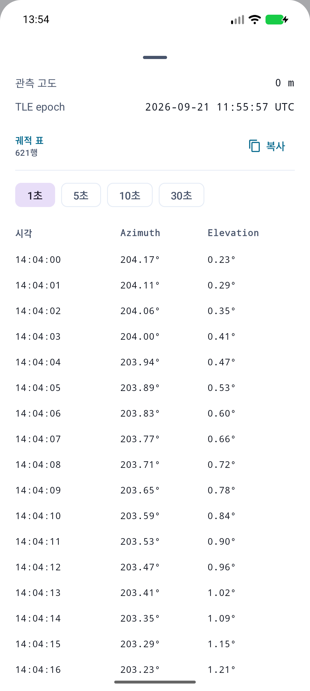

### 목록 복사

화면 오른쪽 위 **복사 아이콘** 을 누르면 패스 일정 전체를 클립보드에 담습니다.
**표로 복사**(엑셀에 붙여넣기 좋음) 와 **CSV로 복사** 중 고를 수 있습니다.

### TLE 새로고침

목록을 아래로 당기면 TLE 를 다시 받아옵니다.
너무 자주 받지 않도록 **최근에 받았으면 건너뜁니다.** (기본 6시간, 설정에서 변경 가능)

인터넷이 안 되면 기존에 받아 둔 데이터로 계속 계산합니다.

---

## 알림 받기

패스가 시작되기 전에 휴대폰 알림을 받을 수 있습니다.

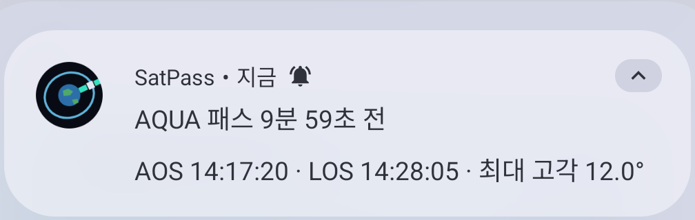

### 알림 켜는 방법 (세 가지)

- 패스 카드를 **오른쪽으로 밀기**
- 오른쪽 위 **종 아이콘** 을 눌러 선택 모드로 들어간 뒤, 알림받을 패스들을 **누르기**
- 카드를 눌러 연 **상세 화면 오른쪽 위 종 버튼**

알림이 켜진 패스에는 카드에 **주황색 종 표시** 가 붙습니다.

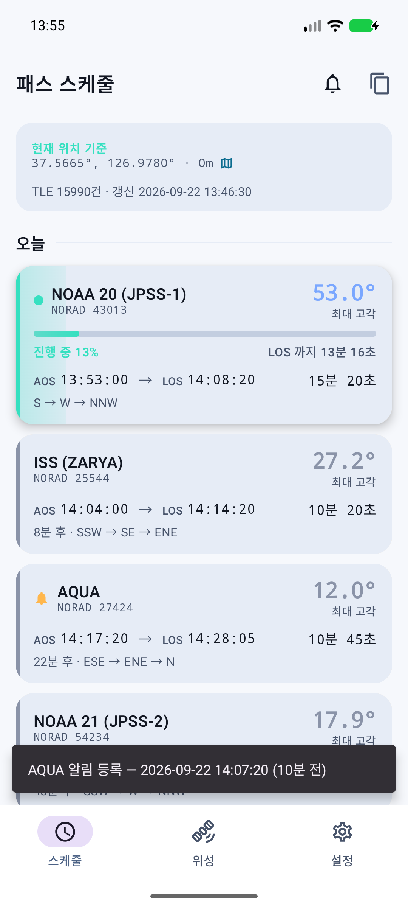

### 알림 시각

**설정 → 패스 알림** 에서 몇 분 전에 알릴지 정합니다. (기본 **10분 전**)

이미 켜 둔 알림들도 값을 바꾸면 함께 조정됩니다.

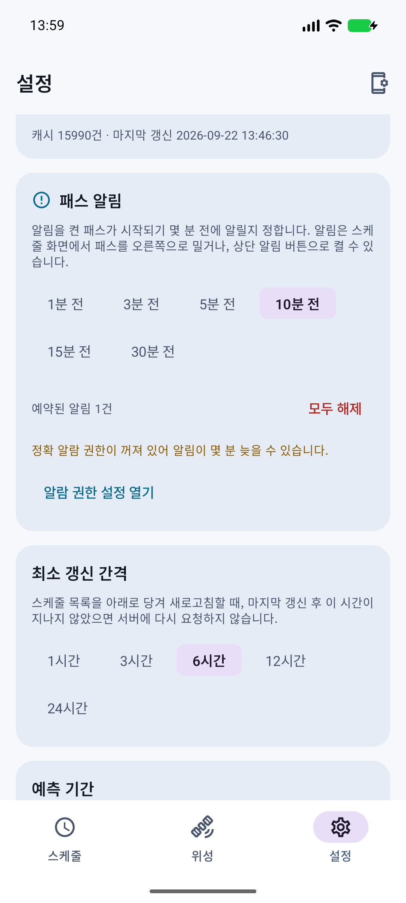

### 알림이 늦게 오거나 안 온다면

설정 화면 **패스 알림** 옆의 **ⓘ** 를 누르면 자세한 설명이 나옵니다. 요점은 두 가지입니다.

1. **정확 알람 권한** — 안드로이드는 배터리를 아끼려고 알람을 모아서 처리하기 때문에
   이 권한이 없으면 알림이 몇 분 늦을 수 있습니다. 패스는 5~15분 만에 지나가므로
   켜 두는 것이 좋습니다. 설정 화면의 안내 버튼으로 바로 갈 수 있습니다.
2. **제조사 절전 기능** — 삼성·샤오미 등은 자체 절전 기능이 따로 있습니다.
   `설정 → 배터리 → 백그라운드 사용 제한` 에서 이 앱을 **제한 없음** 으로 두면 확실합니다.

설정 화면 오른쪽 위 버튼을 누르면 휴대폰의 **앱 정보** 화면으로 바로 이동합니다.

---

## 위성 관리

**위성** 탭에서 등록한 위성을 관리합니다.

### 보고 싶은 위성만 켜기

각 위성 오른쪽의 **스위치** 로 스케줄에 표시할지 정합니다.
꺼도 목록에서 사라지지 않으니, 잠깐 빼 두고 싶을 때 쓰면 됩니다.

**전체 선택 / 전체 해제** 로 한 번에 바꿀 수도 있습니다.

### TLE 확인하기

위성 **이름을 누르면** 그 위성의 TLE 3줄을 볼 수 있습니다.
여기서 **복사**, **수정**, (직접 입력한 것이라면) **삭제** 가 가능합니다.

### TLE 직접 입력하기

아직 공개 목록에 없는 위성이나, 별도로 받은 궤도 정보를 쓰고 싶을 때 사용합니다.

**위성** 탭의 **TLE 직접 입력** 버튼을 누르면 칸이 나뉜 입력 화면이 열립니다.

- 칸마다 **한 글자씩** 넣으면 다음 칸으로 자동으로 넘어갑니다.
- 항상 공백인 자리는 자동으로 건너뜁니다.
- 줄이 화면보다 길어서 **좌우로 스크롤** 됩니다. 칸 위의 숫자가 몇 번째 자리인지 알려 줍니다.
- **체크섬은 직접 넣지 않습니다.** 나머지 칸이 모두 채워지면 자동으로 계산되어 들어갑니다.
  빈 칸이 하나라도 있으면 계산하지 않고 기다립니다.
- 이미 TLE 문자열이 있다면 **붙여넣기** 버튼으로 한 번에 채울 수 있습니다.

입력하는 동안 형식을 계속 검사해서, 잘못된 곳이 있으면 **어디가 왜 잘못됐는지** 알려 줍니다.
검사를 통과해야 저장 버튼이 활성화됩니다.

> 직접 입력한 TLE 는 **공개 목록을 새로 받아도 덮어쓰이지 않습니다.**
> 원래 값으로 되돌리려면 TLE 화면에서 **삭제** 를 누르세요.

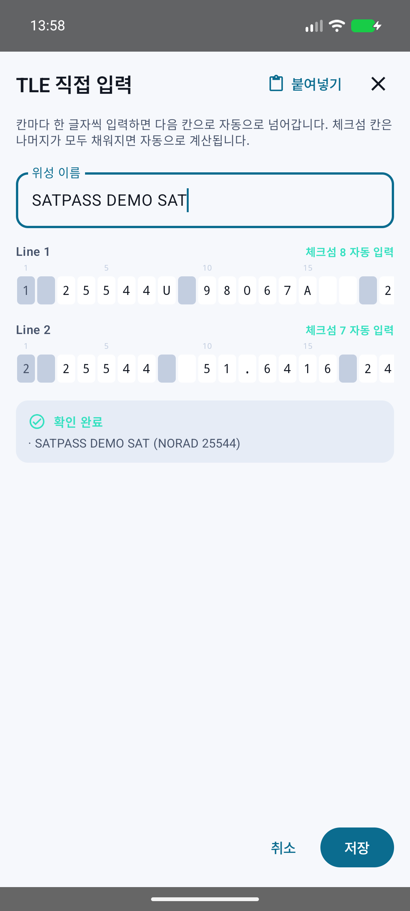

---

## 관측 위치 바꾸기

기본적으로 휴대폰의 **현재 위치** 를 씁니다. 지상국처럼 정해진 곳을 자주 쓴다면
좌표를 저장해 두고 골라 쓸 수 있습니다.

**설정 → 관측 위치** 에서 **지점 추가** 를 누르고 이름과 좌표를 넣습니다.
**현재 위치로 채우기** 를 누르면 좌표를 직접 입력하지 않아도 됩니다.

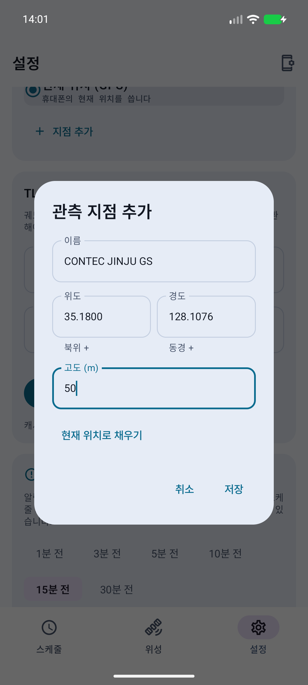

저장해 둔 지점이 있으면 스케줄 화면 위쪽의 **⇄ 아이콘** 으로 바로 전환할 수 있습니다.

스케줄 화면의 **좌표를 누르면** 지도 앱에서 그 위치를 열어 확인할 수 있습니다.

---

## 설정 항목

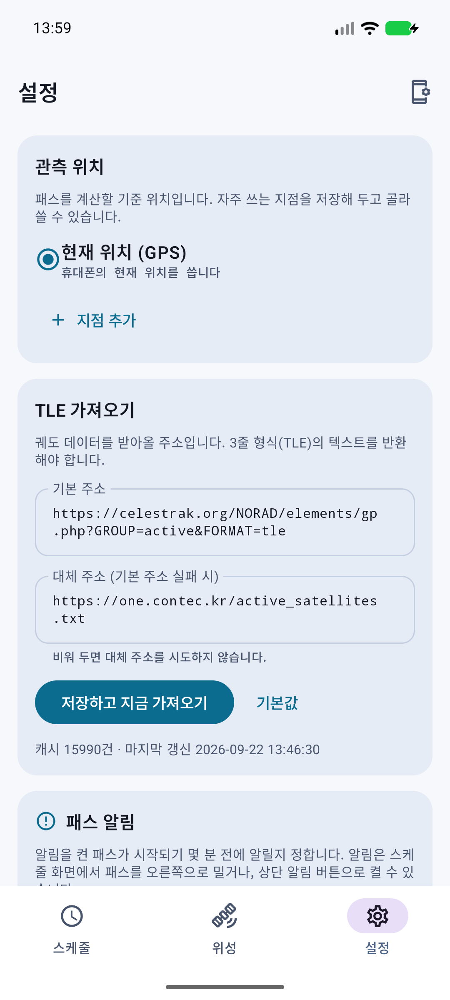

| 항목 | 설명 | 기본값 |
| --- | --- | --- |
| 관측 위치 | 현재 위치(GPS) 또는 저장해 둔 지점 | 현재 위치 |
| 패스 알림 | 패스 시작 몇 분 전에 알릴지 | 10분 전 |
| TLE 가져오기 | 궤도 정보를 받아올 주소 (기본 / 대체) | CelesTrak |
| 최소 갱신 간격 | 이 시간 안에는 다시 받지 않음 | 6시간 |
| 예측 기간 | 앞으로 며칠분을 계산할지 | 3일 |
| 최소 고각 | 이보다 낮은 패스는 숨김 | 전체 표시 |

### TLE 를 받아올 주소

기본 주소가 실패하면 **대체 주소** 를 시도합니다. 둘 다 실패하면 기존 데이터를 그대로 씁니다.

| 구분 | 기본값 |
| --- | --- |
| 기본 | `https://celestrak.org/NORAD/elements/gp.php?GROUP=active&FORMAT=tle` |
| 대체 | `https://one.contec.kr/active_satellites.txt` |

3줄 형식(TLE) 텍스트를 반환하는 주소라면 무엇이든 넣을 수 있습니다.

---

## 자주 겪는 문제

**위성 검색이 안 됩니다**
→ TLE 를 아직 받지 않았습니다. 스케줄 탭에서 화면을 아래로 당겨 주세요.

**"앞으로 N일간 패스가 없습니다" 라고 나옵니다**
→ 설정에서 **예측 기간** 을 늘리거나 **최소 고각** 을 낮춰 보세요.
정지궤도 위성처럼 지평선 아래에만 있는 위성은 패스가 생기지 않습니다.

**"기본 위치로 계산 중" 이라고 나옵니다**
→ 위치 권한이 없거나 위치를 얻지 못한 상태입니다. **위치 허용** 을 누르거나,
설정에서 관측 지점을 직접 등록해 주세요.

**일부 위성만 계산이 안 됩니다**
→ 스케줄 화면 위쪽에 이유가 표시됩니다. 대부분 그 위성의 TLE 가 목록에 없는 경우이며,
TLE 를 새로 받거나 직접 입력하면 해결됩니다.

**알림이 안 옵니다**
→ [알림이 늦게 오거나 안 온다면](#알림이-늦게-오거나-안-온다면) 을 참고하세요.

---

## 어떻게 계산하나요

공개된 **TLE**(Two-Line Element, 두 줄로 된 궤도 정보)와 위성 궤도 표준 모델인
**SGP4** 를 사용합니다. 계산에는 오픈소스 라이브러리 [predict4java](https://github.com/g4dpz/predict4java) 를 씁니다.

TLE 는 시간이 지날수록 실제 궤도와 어긋나므로, 정확한 예측을 위해 가끔 새로 받아 주는 것이 좋습니다.
상세 화면에서 계산에 쓰인 TLE 의 기준 시각(epoch)을 확인할 수 있습니다.

---

## 개발자용

<details>
<summary>빌드와 배포 방법</summary>

### 빌드

```bash
./gradlew :app:assembleDebug     # APK: app/build/outputs/apk/debug/app-debug.apk
./gradlew :app:testDebugUnitTest # 단위 테스트
```

| 항목 | 버전 |
| --- | --- |
| JDK | 21 |
| Gradle | 9.7.1 (wrapper 포함) |
| AGP | 9.4.0 |
| Kotlin | 2.2.10 (AGP 내장) |
| compileSdk | 37 |
| minSdk | 26 (`java.time` 을 desugaring 없이 사용) |
| targetSdk | 36 |

Gradle 데몬이 쓸 JDK 는 `gradle/gradle-daemon-jvm.properties` 의 `toolchainVersion=21` 로
정해집니다. 특정 경로를 박아 넣지 않으므로 개발 PC 와 CI 가 각자 설치된 JDK 21 을 찾아 씁니다.

AGP 9 는 Kotlin 을 내장(built-in Kotlin)하므로 `org.jetbrains.kotlin.android` 플러그인을
따로 적용하지 않습니다. KSP 가 `kotlin.sourceSets` 를 쓰기 때문에
`android.disallowKotlinSourceSets=false` 가 필요합니다.

### 기술 스택

- Kotlin, Jetpack Compose (Material 3)
- Room (관심 위성 + TLE 캐시 + 관측 지점 + 알림)
- Retrofit / OkHttp (TLE 수집)
- DataStore Preferences (설정)
- FusedLocationProviderClient (위치)
- AlarmManager (패스 알림)
- predict4java (SGP4 궤도 계산)

### predict4java 에 대해

predict4java 는 Maven Central 에 없고 JitPack 에만 올라가 있습니다
(`com.github.g4dpz:predict4java` — `1.2.0` 만 빌드 성공, `1.2.2` 이후는 빌드 실패 상태).

그래서 의존성으로 받는 대신 소스를 `app/src/main/java/kr/contec/satpass/orbit/` 에 이식했습니다.

원본은 Guava / commons-lang3 / commons-logging 에 의존하지만 실제 사용처는
`Preconditions.checkArgument` 1곳, `StringUtils.strip` 4곳, 로거 1곳뿐이라
순수 JDK 코드와 `android.util.Log` 로 대체해 **추가 의존성이 없습니다.**
JitPack 빌드 가용성에 앱 빌드가 묶이지도 않습니다.

### 배포

**Actions 탭 → "배포 (APK 릴리스)" → Run workflow** 를 누르면 APK 를 빌드해서
Releases 에 붙여 줍니다. 실행이 끝나면 요약(Summary)에 릴리스 링크가 뜹니다.

`v1.0` 같은 태그를 푸시해도 같은 워크플로가 돕니다.

현재 릴리스 APK 는 **디버그 키로 서명** 됩니다. 설치와 동작에는 문제가 없지만,
Play 스토어 배포나 기기 간 업데이트 서명 일치가 필요해지면 릴리스 키스토어를
GitHub Secrets 로 등록하고 `signingConfigs` 를 추가해야 합니다.

</details>
